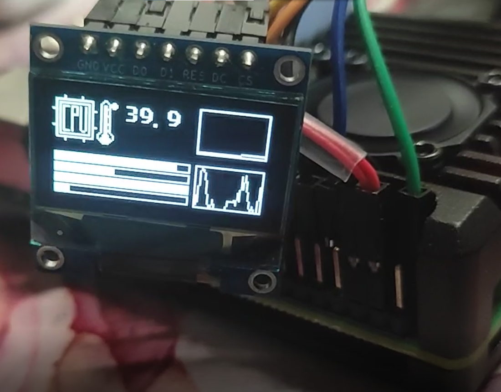
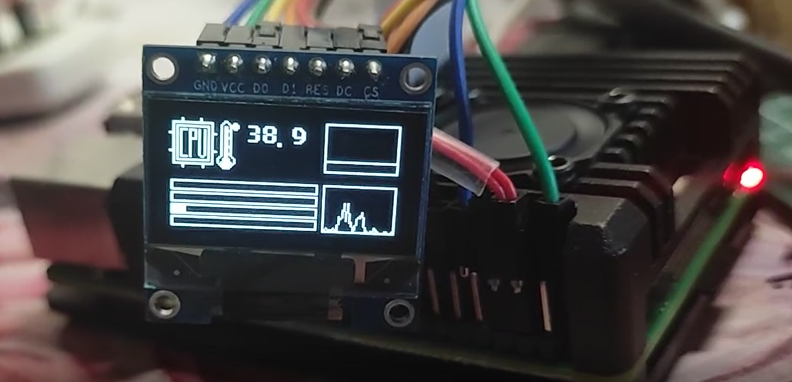

# PiStaTus ——Pi资源实时监控
## 简介
显示RPi的CPU温度，CPU利用率，内存利用率到连接的OLED屏幕上
> 支持平台 4B(32位系统/64位系统)

* 界面中间数字为`CPU`温度
* 下面4个条表示树莓派4个核心的利用率
* 右上角表示过去时刻`内存Mem`利用率的曲线图
* 右下角表示过去时刻`CPU总利用率`的曲线图
> 效果展示

## 接线
使用7接口的0.96寸oled屏幕（128*64） 
输入
~~~shell
gpio readall
~~~
来查看引脚分布
> 无法查看？
树莓派4B使用的是`2.50`版本的`WiringPi`，需要先升级到`2.52`版本，见下文 __使用__ ,升级后再输入`gpio readall`即可查看引脚。

VCC - > VCC 
GND - > GND 
D0 - > SCLK(BCM编号为11) 
D1 - > MOSI(BCM编号为10) 
RES - > GPIO. 3(BCM编号为22) 
DC - > GPIO. 2(BCM编号为27) 
CS - > GPIO. 0(BCM编号为17) 

## 使用
1. OLED使用`SPI`通信，依赖`wiringPi  -version 2.52`,树莓派本身自带`wiringPi -version 2.50` 需要升级至2.52版本（<a href="http://wiringpi.com/wiringpi-updated-to-2-52-for-the-raspberry-pi-4b/">详见原作者文章</a>）
~~~shell
cd /tmp
wget https://project-downloads.drogon.net/wiringpi-latest.deb
sudo dpkg -i wiringpi-latest.deb
~~~
然后输入
~~~shell
gpio -v
~~~
查看版本是否为2.52。

2. 获取`PiStaTus`
~~~shell
cd ~/
git clone https://github.com/Janey7695/PiStaTus.git
cd PiStaTus/
~~~
3. `PiStaTus`初始化
~~~shell
sudo ./PiStatusInit
~~~
初始化会设置`PiStaTus`为开机自启动，执行完这步后oled屏幕应该就有显示东西了，`PiStaTus`安装完成。

